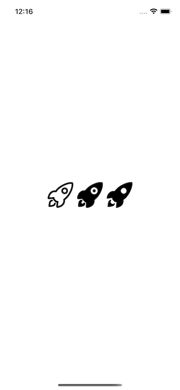

# React Native Ionicons 5


Use the latest [Ionicons](https://ionicons.com) in your React Native project :tada:.


## Why Ionicons 5 ?
Ionicons is a completely open-source icon set with 1,300 icons.


Each icon has an outline, filled, and sharp variant.

### Outline


### Filled


### Sharp


## Install
```
npm install @michaelbnd/react-native-ionicons
npm install react-native-svg
npx pod-install
```

## Usage
```javascript
import React from 'react';
import {View} from 'react-native';
import {Icon} from '@michaelbnd/react-native-ionicons';

export default function App() {
  return (
    <View style={{flex: 1, alignItems: 'center', justifyContent: 'center', flexDirection: 'row'}}>
      <Icon name="rocket-outline" size={64} color="#000" />
      <Icon name="rocket" size={64} color="#000" />
      <Icon name="rocket-sharp" size={64} color="#000" />
    </View>
  );
}
```




## Jest
Add the lines below in your package.json inside the "jest" key if you are testing your project with [Jest](https://jestjs.io).


```
"transformIgnorePatterns": [
  "/node_modules/(?!react-native)/.+"
]
```
